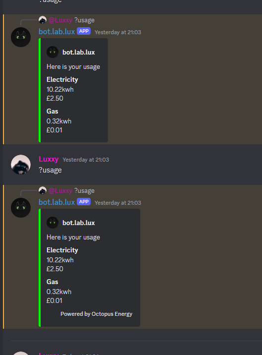
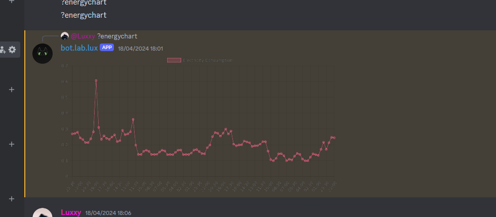

# octopus bot

## Description
this is a discord bot that interacts with the octopus energy api to provide information about your energy usage and costs. 


## Installation
1. Clone the repository
2. Install the required packages using `npm install`
3. Create a `.env` file in the root directory and add the following variables:
```
DISCORD_TOKEN=your_discord_bot_token
```
4. Configure the bot with the configuration file in `config.json`

# API
The bot uses the octopus energy api to get information about your energy usage and costs. You can find more information about the api [here](https://developer.octopus.energy/docs/api/)

and the api key can be obtained from [here](https://octopus.energy/dashboard/developer/)

## Photos

